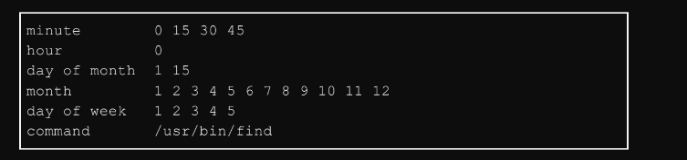

## Problem Statement

1. Write a command line application or script which parses a cron string and expands each field to show the times at which it will run. You may use whichever language you feel most comfortable with.
2. You should only consider the standard cron format with five time fields (minute, hour, day of month, month, and day of week) plus a command, and you do not need to handle the special time strings such as "@yearly". The input will be on a single line.

3. The cron string will be passed to your application as a single argument.
    <pre>
   `~$ your-program "_/15 0 1,15 _ 1-5 /usr/bin/find"`
   </pre>

4. The output should be formatted as a table with the field name taking the first 14 columns and the times as a space-separated list following it.
   For example, the following input argument:
   <pre>
   `_/15 0 1,15 _ 1-5 /usr/bin/find`
   </pre>

   Should yield the following output:
   

5. You should spend no more than three hours on this exercise. If you do not have time to handle all possible cron strings then an app which handles a subset of them correctly is better than one which does not run or produces incorrect results. You will be asked to extend the solution with additional features while onsite.

6. You should see your project reviewer as a new team member you are handing the project over to. Provide everything you feel would be relevant for them to ramp up quickly, such as tests, a README and instructions for how to run your project in a clean OS X/Linux environment.
